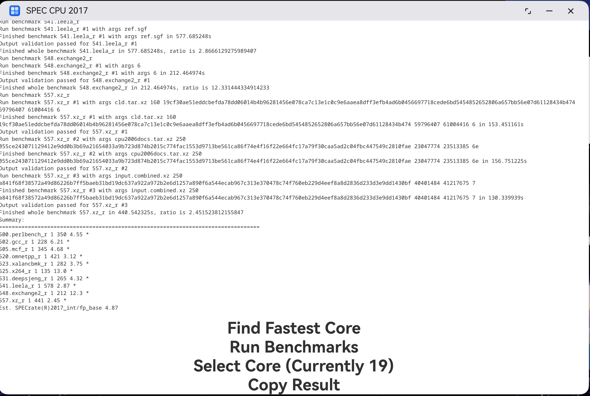

# SPEC CPU 2017 Harmony

Running SPEC INT 2017 benchmark on HUAWEI MateBook Pro:

## Overview

Run SPEC CPU 2017 benchmark on OpenHarmony/HarmonyOS NEXT. Please update SPEC CPU 2017 to the latest version available, otherwise see [#2](https://github.com/jiegec/SPECCPU2017Harmony/issues/2) for possible workarounds.

It currently supports running SPEC CPU 2017 int rate-1 and fp rate-1.

## Usage

How to build on macOS (missing support for benchmarks that use Fortran):

1. Copy the whole benchspec folder from SPEC CPU 2017 installation to the root folder of this project
2. Execute `perl generate.perl` under the root folder of this project
3. Use DevEco Studio to open this project
4. Setup code signing using DevEco Studio
5. Execute `./build-macos.sh` under the root folder of this project

How to build on Linux (all benchmarks are working):

1. Install lld-20 and flang-20 from [LLVM APT](https://apt.llvm.org/)
2. Copy the whole benchspec folder from SPEC CPU 2017 installation to the root folder of this project
3. Execute `perl generate.perl` under the root folder of this project
4. Clone llvm-project to $HOME/llvm-project
5. Execute `./build-flang.sh` under the root folder of this project
6. Copy code signing config (including build-profile.json5 and ~/.ohos/config) from macOS/Windows
7. Execute `./build-linux.sh` under the root folder of this project

To install the application to phone: either use DevEco Studio, or use `push.sh`.

## Result

If you want to find existing benchmark results, please refer to [results](./results/README.md) folder. Tested devices:

- Pura 70 Pro+
- MateBook Pro

## How does it work

Because HarmonyOS NEXT does not permit the execution of binaries in the data folder, each benchmark (including the input generator and output validator) is compiled into a shared library. To execute the benchmark, the shared library is loaded, and its main function is invoked with the appropriate arguments.

To prevent memory exhaustion caused by potential memory leaks, each benchmark is executed within a forked child process. Upon the child process's termination, the memory is automatically reclaimed. The execution time is measured from the parent process, which includes the minimal overhead of process startup and shutdown.

Certain benchmarks require an exceptionally large stack size (on the order of hundreds of megabytes). However, setting the stack size limit using `setrlimit` does not function as intended. To address this, a manual switch implemented in assembly is used to run the benchmark on a heap-allocated 1GB stack.

P.S. It seems that on MateBookPro, execve syscall is allowed, so it is possible to run statically linked SPEC CPU 2017 binaries instead of rebuilding it with Clang/Flang. Investigation is pending.

## TODO

- copies>1 of rate tests
- speed tests
